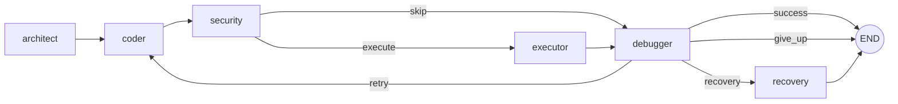

# self-healing-coder

A production-grade multi-agent coding assistant built on **LangGraph + E2B + Langfuse**.
An **Architect** drafts a spec → a **Coder** writes Python → a **Security** node statically scans it (Bandit) → an **Executor** runs it inside an E2B Firecracker microVM → a **Debugger** loops fixes back up to N times before giving up. Generated code is **never** executed on the host.

---

## Why this project is interesting

- **Self-healing loop** — strict `Literal["retry"|"success"|"give_up"|"recovery"]` router; iteration cap clamped on the LLM, not by the router.
- **Defense in depth** — Bandit static scan blocks HIGH-severity findings *before* the sandbox even sees the code.
- **Cost-aware** — Anthropic prompt caching (`cache_control: ephemeral`) on every system prompt + per-run token/USD telemetry.
- **Observable** — Langfuse v3 spans for every LLM call, attached at both `make_llm` and graph compile time so the trace nests correctly.
- **Resumable** — optional SQLite checkpointer; interrupt mid-run and resume by `thread_id`.
- **Benchmarked** — built-in eval harness with pass-rate, mean iterations, and cost per task; emits Markdown or JSON reports.
- **Two interfaces** — Typer CLI streaming via `rich`; FastAPI server with Server-Sent Events.

---

## Architecture



State is a single `AgentState` TypedDict. Nodes return *partial* dict updates; LangGraph reducers merge `history` and `artifacts` lists. The router is pure; `iteration` is incremented in the Coder.

Regenerate the live diagram any time:

```powershell
self-healing-coder graph mermaid -o docs/graph.mmd
```

---

## Quickstart

```powershell
python -m venv .venv
.\.venv\Scripts\Activate.ps1
pip install -e ".[dev,server,security,sqlite]"
copy .env.example .env
# fill in ANTHROPIC_API_KEY, E2B_API_KEY, LANGFUSE_*  (Langfuse is optional)
```

### Run a task

```powershell
self-healing-coder run "Write a script that prints the first 10 prime numbers."
```

### Save artifacts produced inside the sandbox

```powershell
self-healing-coder run "Fetch top 5 HN story titles and save them to titles.csv" -a artifacts/run-1
```

### Resumable runs

```powershell
self-healing-coder run "..." --sqlite .checkpoints.sqlite --thread-id my-run
# kill it mid-execution; later:
self-healing-coder resume my-run --sqlite .checkpoints.sqlite
```

### Run the benchmark suite

```powershell
self-healing-coder eval                              # all 10 tasks
self-healing-coder eval --task primes_10             # just one
self-healing-coder eval --report eval-report.md      # write Markdown report
```

Sample report row:

| task | passed | verdict | iters | dur (s) | cost ($) |
|------|--------|---------|-------|---------|----------|
| primes_10 | ✅ | success | 1 | 4.21 | 0.0023 |

### Serve as an API

```powershell
self-healing-coder serve --host 0.0.0.0 --port 8000
# or
docker build -t self-healing-coder .
docker run -p 8000:8000 --env-file .env self-healing-coder
```

Endpoints:
- `POST /run`           — synchronous; returns final state + cost.
- `POST /run/stream`    — SSE stream of node updates.
- `GET  /health`        — liveness probe.
- `GET  /graph/mermaid` — current graph diagram.

---

## Where LLM calls happen (Langfuse spans)

Three places — the only Anthropic generations:

1. [agents/architect.py](src/self_healing_coder/agents/architect.py) — `architect_node`
2. [agents/coder.py](src/self_healing_coder/agents/coder.py) — `coder_node`
3. [agents/debugger.py](src/self_healing_coder/agents/debugger.py) — `debugger_node` (uses `with_structured_output`)

The Executor is deterministic; routers are pure.

---

## Cost engineering

Every Anthropic system prompt is wrapped via [`cached_system()`](src/self_healing_coder/llm.py) with `cache_control={"type": "ephemeral"}`. On the second call within 5 minutes, those tokens are billed at ~10% of the input price. Per-run telemetry from [`telemetry.py`](src/self_healing_coder/telemetry.py) is rendered at the end of every CLI run:

```
              run cost
┏━━━━━━━━━━━━━━━━━━━━┳━━━━━━━━━━━━━┓
┃ metric             ┃       value ┃
┡━━━━━━━━━━━━━━━━━━━━╇━━━━━━━━━━━━━┩
│ LLM calls          │           3 │
│ input tokens       │       1,204 │
│ output tokens      │         287 │
│ cache read tokens  │       1,002 │
│ estimated cost (USD)│   $0.00832  │
└────────────────────┴─────────────┘
```

---

## Test

```powershell
pytest -q
```

Tests run fully offline — they patch `make_llm` and inject a fake `e2b_code_interpreter` module so neither the Anthropic API nor an E2B sandbox is contacted.

---

## Project layout

```
src/self_healing_coder/
├── state.py            AgentState + ExecutionResult + reducers
├── config.py           pydantic-settings loader
├── observability.py    Langfuse v3 callback factory
├── telemetry.py        Token/cost tracker callback
├── llm.py              ChatAnthropic factory + cached_system()
├── persistence.py      MemorySaver / SqliteSaver factories
├── tools/e2b_executor.py   sandbox wrapper + artifact download
├── prompts/{architect,coder,debugger}.md
├── agents/
│   ├── architect.py    LLM call #1
│   ├── coder.py        LLM call #2 + ```python regex extractor
│   ├── security.py     Bandit static scan (defense in depth)
│   ├── executor.py     deterministic E2B run
│   └── debugger.py     LLM call #3 with structured output
├── graph/
│   ├── routers.py      pure Literal routers
│   └── builder.py      StateGraph wiring + render_mermaid()
├── eval/
│   ├── tasks.py        10-task benchmark
│   └── runner.py       evaluate(), summarize(), write_report()
├── server.py           FastAPI + SSE
└── cli.py              Typer app: run / resume / eval / graph / serve
tests/
├── test_state_contract.py / test_router_enum.py
├── test_executor_mock.py / test_security_node.py
├── test_telemetry.py / test_eval_harness.py
├── test_server.py / test_e2e_happy_path.py
.github/workflows/ci.yml      ruff + mypy + pytest matrix
Dockerfile / .pre-commit-config.yaml
```
